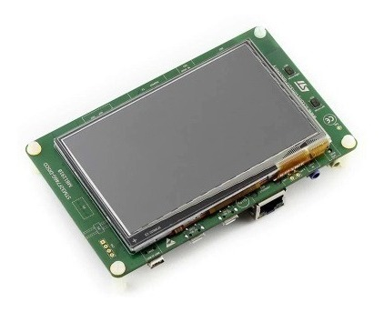

# Victoria_Alexa

Projeto final da disciplina Microcontroladores utilizando STM32F746.

## Motivação

Quando pensamos em solucionar um problema do cotidiano, o assunto IoT (Internet das Coisas) surge rapidamente. O tema refere-se a implementação de sensores e outros sistemas digitais em objetos para funcionar de forma mais inteligente por meio da troca de informações entre seres vivos e inanimados, não necessariamente utilizando conexões de internet.

Essas trocas de informações podem ocorrer via radiofrequência (RFID), WiFi, Ethernet, Bluetooth, entre outras formas de conexão existentes atualmente, e os sistemas de redes de comunicação existem em diferentes proporções, podendo ser conectados à web mundial ou apenas à rede de casa ou ao carro do usuário, por exemplo.

Pela variedade de aplicações e pela crescente importância do tema, escolheu-se realizar um projeto que envolvesse IoT utilizando a Alexa, assistente virtual da Amazon.

## Descrição

Pela complexidade do projeto e pelo pouco tempo disponível, o trabalho foi dividido em 3 partes:

1. Criação de ambiente 
2. Comunicação com a Nuvem
3. Rotina

Neste repositório trataremos sobre a 3ª etapa. O objetivo é que por um comando de voz dado à Alexa seja possível acender um LED da placa STM32F746 que pode ser observada na imagem a seguir.

  

O Datasheet está disponível na pasta "Docs". Para executar o projeto vamos utilizar o periférico Ethernet que receberá o sinal do servidor da Alexa.

## Diagrama de blocos

  

## Tabela de pinagem

A pinagem completa pode ser vista nesta [tabela](https://docs.google.com/spreadsheets/d/1Sw0a9_pRrKhN5JRSCNtv-Qpn41waan8Ut9J1HC0hoy8/edit?usp=sharing).

  

## Fluxograma

  

## Código

O código pode ser visto no repositório [stm32-vs4a](https://github.com/luizrenault/stm32-vs4a) do Professor Luiz Renault.
